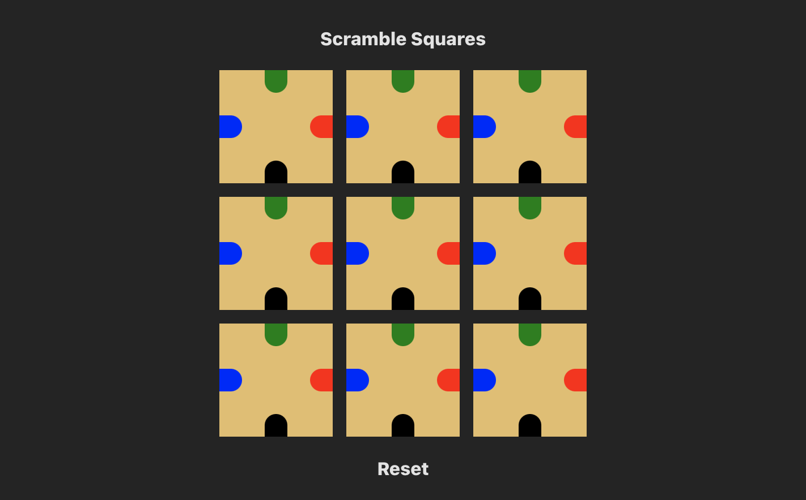

# scramble-squares

A minimal [Scramble Squares](https://scramblesquares.com/) game and solution visualizer. [Demo](https://scramble.cutaiar.io/)

## TODO

- Implement drag interaction
- Implement solver
- Consider these reccomendations from Vite
  - Replace `plugin:@typescript-eslint/recommended` to `plugin:@typescript-eslint/recommended-type-checked` or `plugin:@typescript-eslint/strict-type-checked`
  - Optionally add `plugin:@typescript-eslint/stylistic-type-checked`
